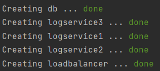
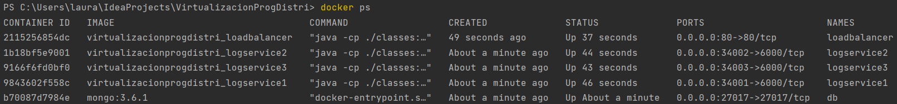
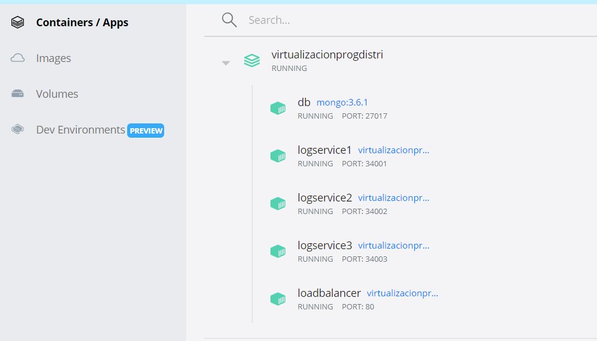
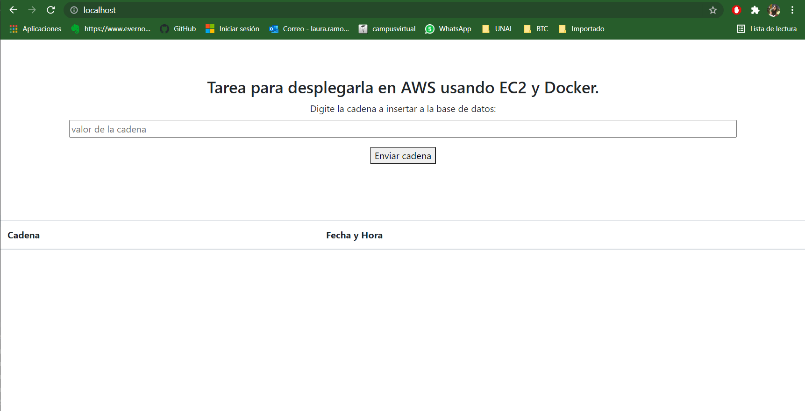
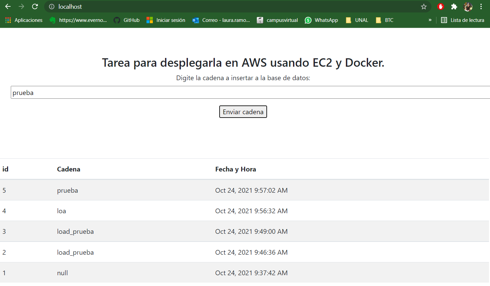
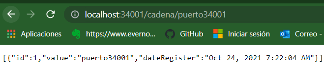
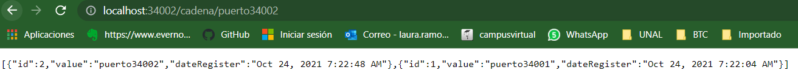
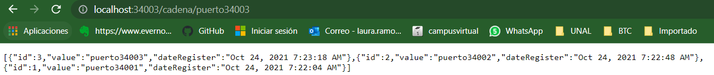

# Taller Virtualizacion y Programacion Distribuida


### Requerimientos previo
1. Instalar docker.
2. Instalar Git.
3. Instalar mvn.

### Componentes de la aplicación
#### Balanceador y front
```
En el repositorio APP-LB-RoundRobin se ecuentra el front y el balanceador Round Robin.
puerto: 80
```
#### Api REST
```
En el repositorio logService se ecuentra el Api REST que corre con SparkJava.
Utiliza la libreria org.mongodb.morphia para conectarse con MongoDB.
puerto: 34001,34002,34003
```

#### Base de datos: MongoDB
```
Se usa la imagen docker de mongo:3.6.1
puerto: 27017
```

### INICIO
1. Clonar este repositorio con git mediante el siguiente comando:
    ```
    git clone https://github.com/LauraMilenaRB/TallerVirtualizacion_ProgDistribuida.git
    ```
2. Ubicado en la carpeta raiz **Virtualizacion y Prog. distribuida** construir el ejecutable desde mediante los siguientes comandos:
    ```
    cd APP-LB-RoundRobin
    mvn package
    cd ..
    cd logService
    mvn package
    cd ..
    ```
3. Desde la raiz **Virtualizacion y Prog. distribuida** ejecutar el archivo docker-compose.yml con el siguiente comando:
    ```
    docker-compose up -d 
    ```
    Al terminar debe ver algo como esto:

    
4. Para comprobar las imagenes que estan corriendo ejecuta el siguiente comando:
    ```
    docker ps
    ```
    
    En caso de tener Docker Desktop en la pestaña Containers/Apps debe visualizar lo siguiente:
    
    
5. Compruebe de manera local que los contenedores se esten ejecutando de manera correcta.
   1. Front y loadbalancer Round Robin.
      
      Luego de enviar la cadena debe visualizarse algo como esto: 
      
   2. logservice1 y conexión con mongoDB.
      
   3. logservice2 y conexión con mongoDB.
      
   4. logservice3 y conexión con mongoDB.
      
   
   