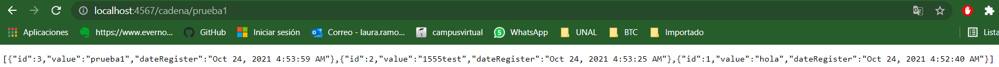

# Taller Virtualizacion y Programacion Distribuida


### Requerimientos previo
1. Instalar docker.
2. Instalar Git.
3. Instalar mvn.

### Componentes de la aplicación
#### Balanceador y front
```
En el repositorio APP-LB-RoundRobin se ecuentra el front y el balanceador Round Robin.
puerto: 80
```
#### Api REST
```
En el repositorio logService se ecuentra el Api REST que corre con SparkJava.
Utiliza la libreria org.mongodb.morphia para conectarse con MongoDB.
puerto: 34001,34002,34003
```

#### Base de datos: MongoDB
```
Se utiliza la imagen docker mongo:3.6.1
puerto: 27017
```

### INICIO
1. Clonar este repositorio con git desde la terminal mediante el siguiente comando:
```
git clone 
```
2. Ubicado en la carpeta raiz **Virtualizacion y Prog. distribuida** construir el ejecutable de los APIRest desde la terminal mediante los siguiente comandos:
```
cd APP-LB-RoundRobin
mvn package
cd ..
cd logService
mvn package
cd ..
```
3.Desde la raiz **Virtualizacion y Prog. distribuida** ejecutar el archivo docker-compose.yml .
```
docker-compose up -d 
```


