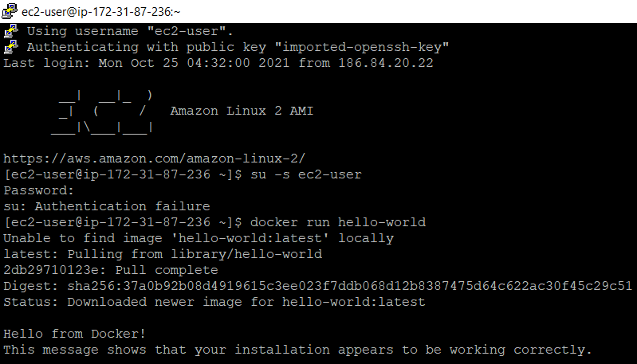
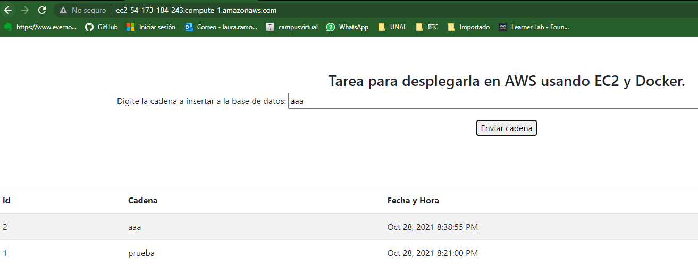

# Taller Virtualizacion y Programacion Distribuida


### Requerimientos previo
1. Instalar docker.
2. Instalar Git.
3. Instalar mvn.

### Componentes de la aplicación

#### Balanceador y front
En el repositorio APP-LB-RoundRobin se ecuentra el front y el balanceador Round Robin.
```
puerto: 80
```
#### Api REST
En el repositorio logService se ecuentra el Api REST que corre con SparkJava.
Utiliza la libreria org.mongodb.morphia para conectarse con MongoDB.
```
puerto: 34001, 34002, 34003
```

#### Base de datos: MongoDB
Se usa la imagen docker de mongo:3.6.1
```
puerto: 27017
```
### Configuracion incial
1. Clonar este repositorio con git mediante el siguiente comando:
    ```
    git clone https://github.com/LauraMilenaRB/TallerVirtualizacion_ProgDistribuida.git
    ```
2. Ubicado en la carpeta raiz **Virtualizacion y Prog. distribuida** construir el ejecutable desde mediante los siguientes comandos:
    ```
    cd APP-LB-RoundRobin
    mvn package
    cd ..
    cd logService
    mvn package
    cd ..
    ```
3. Desde la raiz **Virtualizacion y Prog. distribuida** ejecutar el archivo docker-compose.yml con el siguiente comando:
    ```
    docker-compose up -d 
    ```
    Al terminar debe ver algo como esto:

    
4. Para comprobar las imagenes que estan corriendo ejecuta el siguiente comando:
    ```
    docker ps
    ```
    
    En caso de tener Docker Desktop en la pestaña Containers/Apps debe visualizar lo siguiente:
    
    
5. Compruebe de manera local que los contenedores se esten ejecutando de manera correcta.
   1. Luego de enviar la cadena debe visualizarse algo como esto: .
      
   2. logservice y conexión con mongoDB.
      
   
### Desplegando imagenes en Docker Hub

Luego revisamos las imagenes disponibles y las desplegamos en un repositorio de Docker Hub.
   
   ```
   docker tag mongo:3.6.1 lauramilenarb/db:latest
   docker push lauramilenarb/db:latest
   docker tag virtualizacionprogdistribuida_logservice1:latest lauramilenarb/logservice:latest
   docker push lauramilenarb/logservice:latest
   docker tag virtualizacionprogdistribuida_front_balancer:latest lauramilenarb/front:latest
   docker push lauramilenarb/front:latest

   ```
Luego de ejecutar los comandos anteriores se debe visualizar lo siguiente desde Docker Hub:


### Despliegue en la nube AWS
1. Cree una maquina virtual linux en AWS EC2 y configure los puertos de entrada del security group de la máquina virtual.
   
2. Luego conectese mediante SSH a la maquina virtual para configurarla.
   
3. Instalar docker y docker compose en la máquina virutal
   ```
   sudo yum update -y
   sudo yum install docker
   sudo curl -L "https://github.com/docker/compose/releases/download/1.29.2/docker-compose-$(uname -s)-$(uname -m)" -o /usr/local/bin/docker-compose
   sudo chmod +x /usr/local/bin/docker-compose
   sudo usermod -a -G docker ec2-user
   exit
   ```
4. Conectese nuevamente a la instancia EC2 y luego ejecute los siguientes comandos:
   ```
   sudo service docker start
   docker login 
   ```
5. A partir de los repositorios creados en Docker Hub cree el archivo **docker-compose.yml** con las imagenes desplegadas:
   ```
   version: '2'
   services:
      front_balancer:
         image: lauramilenarb/front
         container_name: front_balancer
         ports:
            - 80:80
         links:
            - logservice1
            - logservice2
            - logservice3
         depends_on:
            - logservice1
            - logservice2
            - logservice3
      logservice1:
         image: lauramilenarb/logservice
         container_name: logservice1
         ports:
            - 34001:6000
         depends_on:
            - db
         logservice2:
         image: lauramilenarb/logservice
         container_name: logservice2
         ports:
            - 34002:6000
         depends_on:
            - db
      logservice3:
         image: lauramilenarb/logservice
         container_name: logservice3
         ports:
            - 34003:6000
         depends_on:
            - db
      db:
         image: lauramilenarb/db
         container_name: db
         volumes:
            - mongodb:/data/db
            - mongodb_config:/data/configdb
         ports:
            - 27017:27017
         command: mongod
   volumes:
      mongodb:
      mongodb_config:
   ```

   Ejecute y verifique que las imagenes se esten ejecutando correctamente con el siguiente comando:
   ```
   docker-compose up -d
   docker ps
   ```
   
6. Verifique que la APP se ejecute correctamente desde AWS.
   
   
   