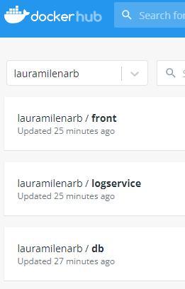

# Taller Virtualizacion y Programacion Distribuida


### Requerimientos previo
1. Instalar docker.
2. Instalar Git.
3. Instalar mvn.

### Componentes de la aplicación

#### Balanceador y front
En el repositorio APP-LB-RoundRobin se ecuentra el front y el balanceador Round Robin.
```
puerto: 80
```
#### Api REST
En el repositorio logService se ecuentra el Api REST que corre con SparkJava.
Utiliza la libreria org.mongodb.morphia para conectarse con MongoDB.
```
puerto: 34001, 34002, 34003
```

#### Base de datos: MongoDB
Se usa la imagen docker de mongo:3.6.1
```
puerto: 27017
```
### Configuracion incial
1. Clonar este repositorio con git mediante el siguiente comando:
    ```
    git clone https://github.com/LauraMilenaRB/TallerVirtualizacion_ProgDistribuida.git
    ```
2. Ubicado en la carpeta raiz **Virtualizacion y Prog. distribuida** construir el ejecutable desde mediante los siguientes comandos:
    ```
    cd APP-LB-RoundRobin
    mvn package
    cd ..
    cd logService
    mvn package
    cd ..
    ```
3. Desde la raiz **Virtualizacion y Prog. distribuida** ejecutar el archivo docker-compose.yml con el siguiente comando:
    ```
    docker-compose up -d 
    ```
    Al terminar debe ver algo como esto:

    
4. Para comprobar las imagenes que estan corriendo ejecuta el siguiente comando:
    ```
    docker ps
    ```
    
    En caso de tener Docker Desktop en la pestaña Containers/Apps debe visualizar lo siguiente:
    
    
5. Compruebe de manera local que los contenedores se esten ejecutando de manera correcta.
   1. Front y loadbalancer Round Robin.
      
      Luego de enviar la cadena debe visualizarse algo como esto: 
      
   2. logservice1 y conexión con mongoDB.
      
   3. logservice2 y conexión con mongoDB.
      
   4. logservice3 y conexión con mongoDB.
      
   
### Desplegando imagenes en DockerHub

Luego revisamos las imagenes disponibles y las desplegamos en un repositorio de DockerHub
   
   ```
   docker tag virtualizacionprogdistribuida_logservice1 lauramilenarb/aygo1:web1
   docker push lauramilenarb/aygo1:web1
   docker tag virtualizacionprogdistribuida_logservice2 lauramilenarb/aygo1:web2
   docker push lauramilenarb/aygo1:web2
   docker tag virtualizacionprogdistribuida_logservice3 lauramilenarb/aygo1:web3
   docker push lauramilenarb/aygo1:web3
   docker tag virtualizacionprogdistribuida_loadbalancer lauramilenarb/aygo1:loadbalancer
   docker push lauramilenarb/aygo1:loadbalancer
   docker tag mongo:3.6.1 lauramilenarb/aygo1:db
   docker push lauramilenarb/aygo1:db
   ```
Luego de ejecutar los comandos anteriores se debe visualizar lo siguiente desde Docker Hub:


### Despliegue en la nube AWS
1. Cree una maquina virtual linux en AWS EC2 y conectese mediante SSH.
   
2. Instalar docker en la máquina virutal
   ```
   sudo yum update -y
   sudo yum install docker
   sudo usermod -a -G docker ec2-user
   exit
   ```
3. Conectese nuevamente a la instancia EC2 y luego ejecute el siguiente comando:
   ```
   sudo service docker start
   docker login ...
   ```
4. A partir del repositorio creado en Dockerhub cree una instancia de un contenedor docker independiente:
   ```
   docker run -d -p 27017:27017 --name db -v mongodb:/data/db -v mongodb_config:/data/configdb lauramilenarb/aygo1:db
   docker run -d -p 34001:6000 --name logserver1 lauramilenarb/aygo1:web1
   docker run -d -p 34002:6000 --name logserver2 lauramilenarb/aygo1:web2
   docker run -d -p 34003:6000 --name logserver3 lauramilenarb/aygo1:web3
   docker run -d -p 80:80 --name loadbalancer lauramilenarb/aygo1:loadbalancer
   ```
   Verifique que se esten ejecutando correctamente con el siguiente comando:
   ```
   docker ps
   ```
   
5. Abra los puertos de entrada del security group de la máquina virtual para acceder al servicio.
   
6. Verifique que la APP se ejecute correctamente desde AWS.
   
   
   